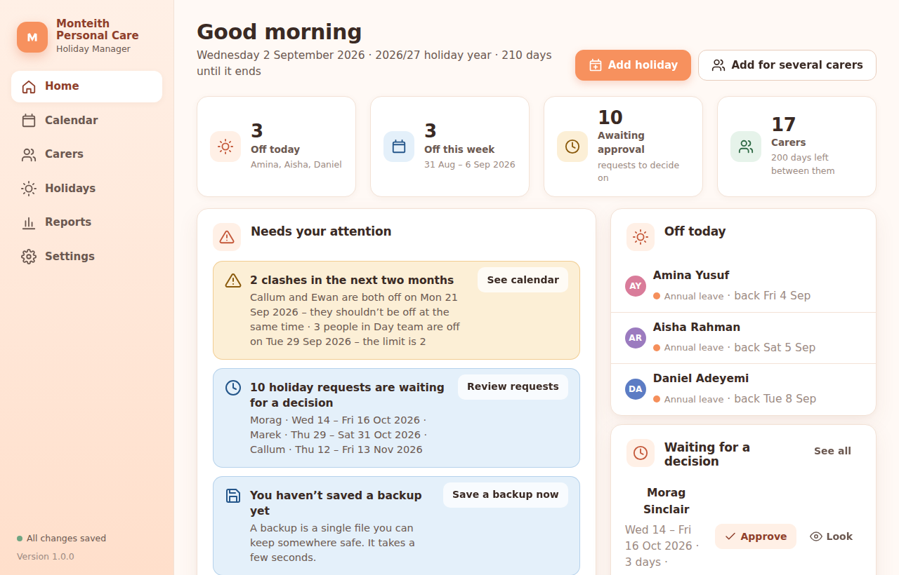
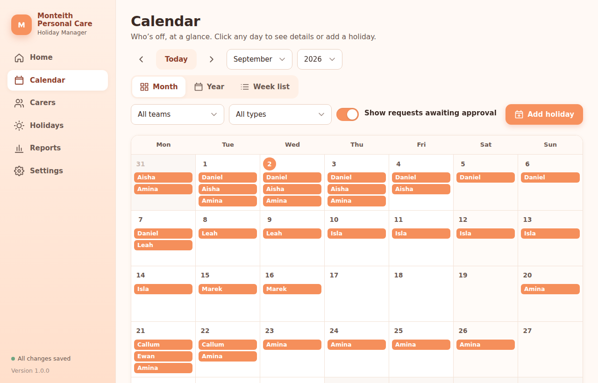
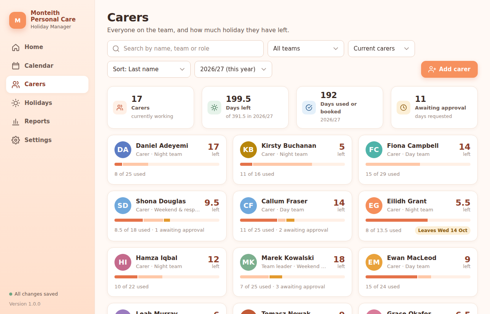
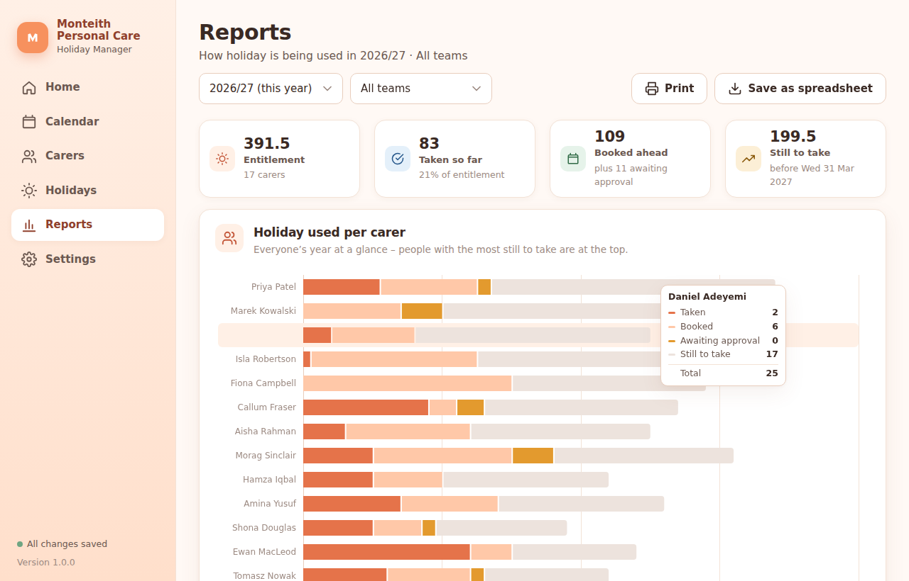
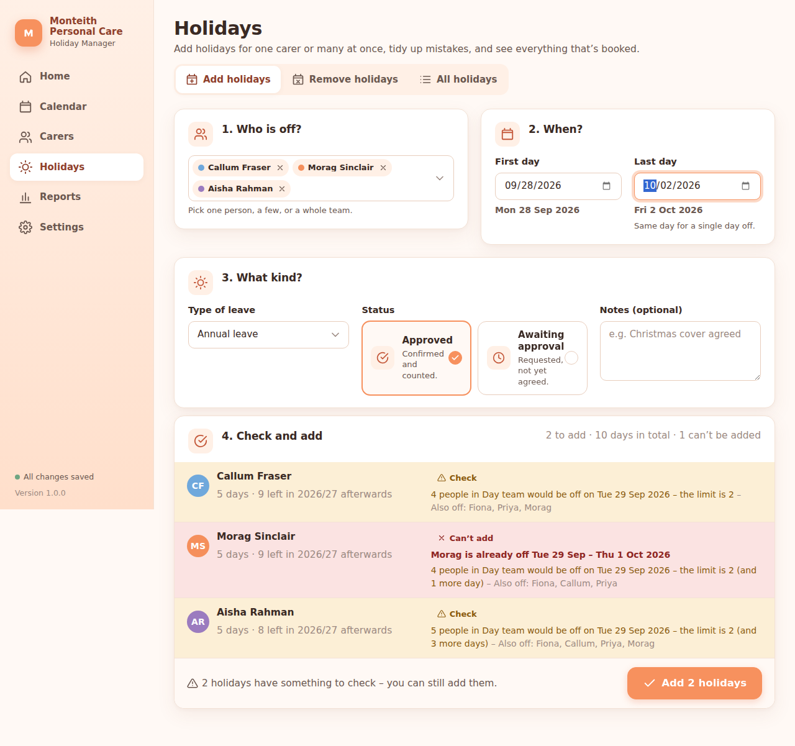

# Monteith Personal Care · Holiday Manager

A calm, peach-coloured holiday manager for the carers at **Monteith Personal Care**.
It keeps track of every carer's annual leave entitlement, shows who is off on a calendar,
lets you add or remove holidays in bulk with simple dropdowns, warns you about clashes,
and gives you clear reports and charts – all without anything to install.

It installs like any other Windows program and opens in its own window. Everything is saved
on the computer it runs on. Nothing is sent over the internet.

## Getting it onto a Windows computer

1. Open the **Releases** page for this project (the link on the right-hand side of the
   GitHub page) and download the file whose name ends in **`Setup.exe`**
   (for example `Monteith-Holiday-Manager-Setup-1.0.0.exe`).
2. Double-click the downloaded file and click **Next** until it finishes. No administrator
   password is needed.
3. A **Monteith Holiday Manager** icon appears on your Desktop and in the Start menu.
   Double-click it whenever you want to open the app.

> **If Windows says "Windows protected your PC"**, click *More info* and then *Run anyway*.
> This message appears simply because the installer isn't from a large software company;
> the app itself never goes on the internet.

The first time, a short welcome screen asks for your holiday year and teams. You can start
with sample data to explore, and clear it later from *Settings → Advanced*.

> Your records are kept on that computer, in your own Windows account. Use *Settings → Backup*
> to save a backup file every week – the Home screen reminds you.

**Prefer not to install anything?** The release also has `Monteith-Holiday-Manager.zip`:
open it, drag the `Monteith Holiday Manager` folder to your Desktop, and double-click the
`Monteith Holiday Manager` program inside it. `READ ME FIRST.txt` in the folder explains the rest.

## What it does

- **Home** – who's off today and this week, what's coming up, and anything needing attention
  (clashes, holidays awaiting approval, carers running low, backup reminders).
- **Calendar** – month view with colour-coded chips per carer, a year overview heat map and a
  week list. Filter by team or leave type. Click any day to see who's off and add a holiday.
- **Carers** – an instantly searchable list of carers with their remaining days at a glance.
  Each profile shows their entitlement breakdown, pro-rata for starters and leavers,
  carry-over adjustments, working pattern and every holiday they've had.
- **Holidays** – add holidays for many carers at once from dropdowns, with a live preview
  that flags clashes in plain English before you confirm. Remove holidays in bulk. See and
  search every holiday ever recorded. Approve or decline requests.
- **Reports** – entitlement usage per carer, leave by month and by type, team capacity heat
  map, sickness, unused-leave warnings, and printable summaries. Export to a spreadsheet.
- **Settings** – company name, holiday year start, teams, leave types, UK bank holidays
  (Scotland, England & Wales or Northern Ireland), staffing rules, backups. Technical
  options are tucked away under *Advanced*.
- **Undo** on every change, half days, bank-holiday-aware day counting, and a friendly first-run
  welcome.
- **Care Empire** – an optional tea-break game in the menu: click a carer to do visits, hire the
  real team, grow from one street to the stars, meet prismatic carers, and earn Legacy Stars each
  time you expand. Switch it off under *Settings → General* if it's not for you.

## What it looks like

| Home | Calendar |
| --- | --- |
|  |  |

| Carers | Reports |
| --- | --- |
|  |  |

Adding holidays for several carers at once, with clashes explained before you confirm:

## For the technically minded

Source lives in `src/` (Preact + signals, plain CSS). `npm install`, then:

| Command | What it does |
| --- | --- |
| `npm run build` | Bundle everything into `Monteith Holiday Manager/Monteith Holiday Manager.html` |
| `npm test` | Unit tests for the calculation logic (`tests/unit`) |
| `npm run test:e2e` | Playwright tests that open the built file over `file://` (`tests/e2e`) |
| `npm run check` | All of the above |

See `CLAUDE.md` and `docs/SPEC.md` for the architecture, data model and product spec.
The built file is committed. On Windows, `node scripts/windows-package.mjs --version v1.1.0`
builds the small host program in `installer/host` (a WebView2 window around the single file,
.NET Framework 4.8), assembles `dist/`, smoke-tests it and builds the installer with Inno Setup
from `installer/MonteithHolidayManager.iss`. The Release workflow does all of this on a Windows
runner. `node scripts/make-icon.mjs` regenerates the icon.
